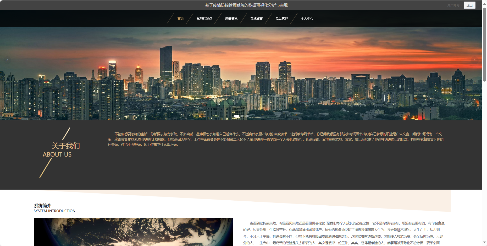
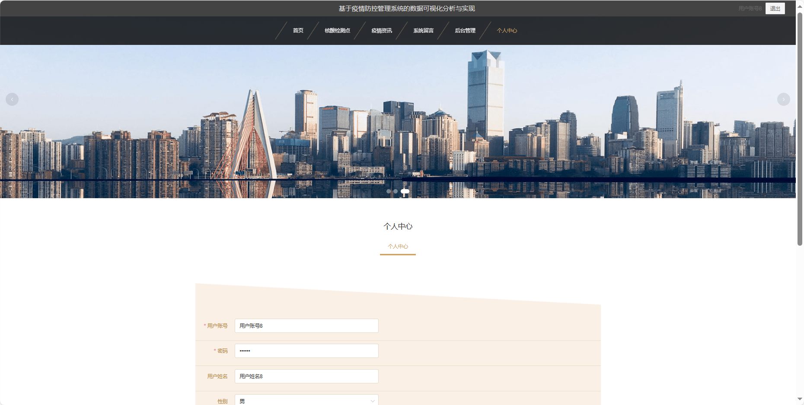
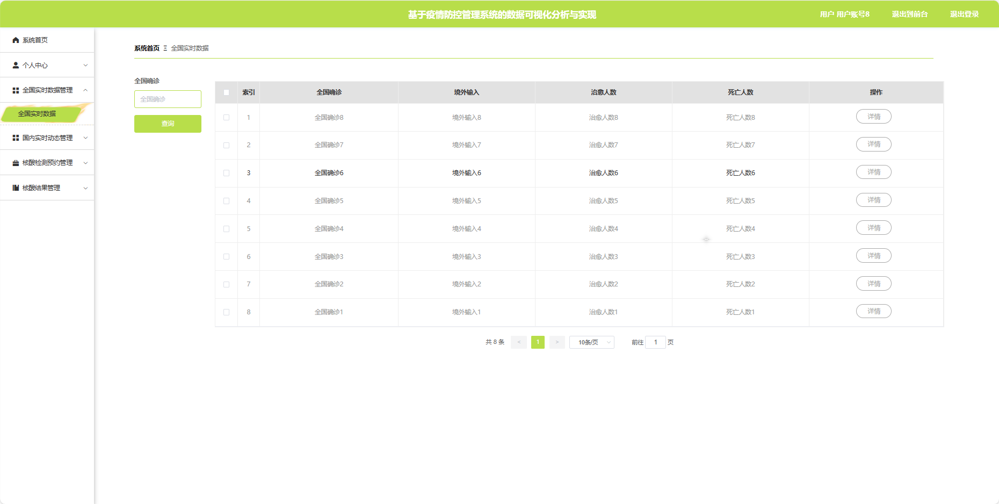

基于Springboot的疫情防控管理系统的数据可视化分析
=
### 完整代码获取地址：从戎源码网 ([https://armycodes.com/](https://armycodes.com/))
### 作者微信：19941326836  QQ：952045282 
### 承接计算机毕业设计、Java毕业设计、Python毕业设计、深度学习、机器学习
### 选题+开题报告+任务书+程序定制+安装调试+论文+答辩ppt 一条龙服务
### 所有选题地址https://github.com/nature924/allProject

一、项目介绍
---
基于Spring Boot框架实现的疫情防控管理系统的数据可视化分析，系统包含三种角色：管理员、用户,防疫人员主要功能如下。
### 【用户功能】

1. **首页：** 查看系统的主要信息。
2. **核酸检测点：** 浏览核酸检测点的位置和相关信息。
3. **疫情资讯：** 获取最新的疫情资讯和预防措施。
4. **系统留言：** 用户间进行留言和交流。
5. **后台管理：**
   - **系统首页：** 管理系统的整体概况和关键数据。
   - **个人中心：** 管理个人信息。
   - **全国实时数据管理：** 查看和分析全国的实时疫情数据。
   - **国内实时动态管理：** 查看国内的实时疫情动态。
   - **核酸检测预约管理：** 预约核酸检测服务。
   - **核酸结果管理：** 查看核酸检测结果。
6. **个人中心：** 管理个人信息。

### 【管理员功能】

1. **系统首页：** 查看系统的整体概况。
2. **个人中心：** 修改密码、管理个人信息。
3. **用户管理：** 审核和管理注册用户的信息。
4. **防疫人员管理：** 审核和管理注册防疫人员的信息。
5. **全国实时数据管理：** 查看和分析全国的实时疫情数据。
6. **国内实时动态管理：** 查看国内的实时疫情动态。
7. **核酸检测点管理：** 管理核酸检测点的位置和相关信息。
8. **核酸检测预约管理：** 管理核酸检测的预约服务。
9. **核酸结果管理：** 管理核酸检测结果。
10. **系统留言：** 管理用户间的留言和交流。
11. **系统管理：**
    - **疫情资讯：** 发布、编辑和删除系统发布的疫情资讯。
    - **关于我们：** 编辑和更新关于系统的介绍。
    - **系统简介：** 提供系统的简要介绍。
    - **轮播图管理：** 管理系统首页的轮播图。

### 【防疫人员功能】

1. **系统首页：** 查看系统的整体。
2. **个人中心：** 修改密码、管理个人信息。
3. **全国实时数据管理：** 查看和分析全国的实时疫情数据。
4. **国内实时动态管理：** 查看国内的实时疫情动态。
5. **核酸检测预约管理：** 管理核酸检测的预约服务。
6. **核酸结果管理：** 管理核酸检测结果。

二、项目技术
---
- 编程语言：Java
- 数据库：MySQL
- 项目管理工具：Maven
- 前端技术：VUE、HTML、Jquery、Bootstrap
- 后端技术：Spring、SpringMVC、MyBatis

三、运行环境
---
- 操作系统：Windows、macOS都可以
- JDK版本：JDK1.8以上都可以
- 开发工具：IDEA、Ecplise、Myecplise都可以
- 数据库: MySQL5.7以上都可以
- Tomcat：任意版本都可以
- Maven：任意版本都可以

四、运行截图
---

### 程序截图：

